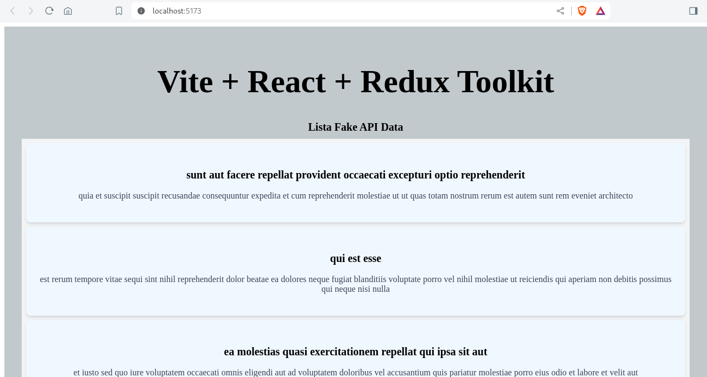

# Post-react-App

This is a React application that displays a list of users obtained from a dummy data API. The application uses Redux Toolkit for state management and Axios for HTTP requests.

**React Features:**

 Main library to build the user interface. 

 * [Redux Toolkit](https://redux-toolkit.js.org/) Used to manage the global state of the application. 
 
 * [Axios](https://axios-http.com/docs/intro) Used to make HTTP requests to the API.
 
 * [Vite](https://vitejs.dev/) Fast and lightweight development tool for web applications.

## Test code
```shell
# cloneing repo
$ git clone git@github.com:luisfercoder/capgemini.git

# Move to directory
$ cd /posts-app

# Run app
$ npm install && npm run dev

Review app at: localhost:5173
```
# Evidence

